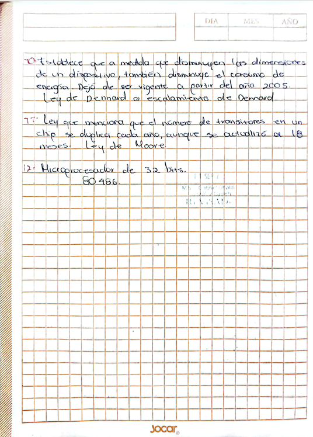
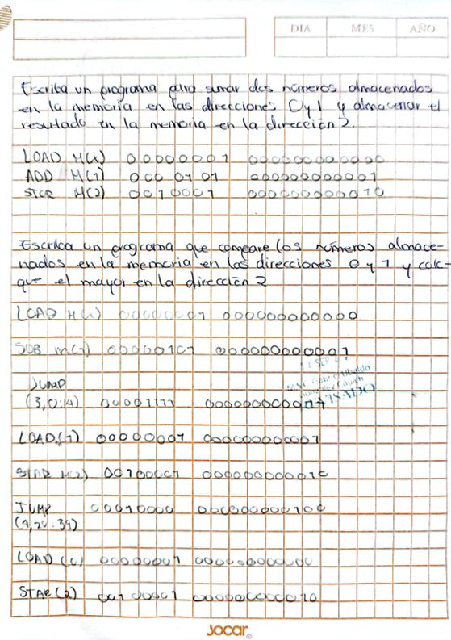

# PORTAFOLIO DE EVIDENCIAS

## Arquitectura de Computadoras

**Instituto:** Instituto Tecnológico de Motul
**Docente:** Gabriel Ubaldo González Cauich 
**Alumno:** Grecia Alexandra Puch Castillo  
**Materia:** Arquitectura de Computadoras  
**Fecha:** 23/09/2026  

---

# ÍNDICE

1. [Introducción](#introducción)
2. [Actividad 1. Evaluación diagnóstica](#actividad-1-evaluación-diagnóstica)
3. [Actividad 2. Ejercicios de programación](#actividad-2-ejercicios-de-programación)
4. [Actividad 3. Mapa conceptual](#actividad-3-mapa-conceptual)
5. [Actividad 4. Reporte de práctica](#actividad-4-reporte-de-práctica)
6. [Reflexión final](#reflexión-final)
7. [Conclusión](#conclusión)

---

# INTRODUCCIÓN

Este portafolio de evidencias reúne las actividades realizadas durante el curso de Arquitectura de Computadoras. Su propósito es mostrar las evidencias de trabajo y reflexionar sobre los conocimientos y habilidades que fui desarrollando durante las actividades.

Las evidencias incluidas permiten observar diferentes tipos de aprendizaje. Algunas actividades están relacionadas con conceptos teóricos de arquitectura de computadoras, mientras que otras requieren aplicar los conocimientos mediante instrucciones y ejercicios de programación.

En este portafolio también se analizan los errores que se presentaron durante las actividades y las acciones que puedo realizar para mejorar mi aprendizaje.

Las actividades incluidas hasta este momento son una evaluación diagnóstica, ejercicios de programación y un mapa conceptual sobre arquitectura de computadoras. Posteriormente se agregará el reporte de una práctica realizada durante el curso.

---

# ACTIVIDAD 1. EVALUACIÓN DIAGNÓSTICA

## Evidencia

La primera actividad corresponde a una evaluación diagnóstica. En ella se realizaron diferentes preguntas relacionadas con los fundamentos de la arquitectura de computadoras y la evolución de los microprocesadores.

Entre los temas abordados se encuentran:

- Registros de diferentes tamaños.
- Arquitectura de computadoras.
- Primera generación de computadoras.
- Segunda generación de computadoras.
- Transistores.
- Microprocesador Intel 4004.
- Ley de Amdahl.
- Ley de Dennard.
- Ley de Moore.
- Microprocesadores de 32 bits.
- Intel 80486.

### Evidencia escaneada




---

## ¿Qué aprendizajes obtuve?

Esta actividad me permitió identificar los conocimientos que ya tenía antes de comenzar a estudiar los temas de la materia. Al responder las preguntas pude recordar algunos conceptos relacionados con la arquitectura de las computadoras y la evolución de los microprocesadores.

Uno de los aprendizajes fue reconocer que existen registros de diferentes tamaños y que estos se relacionan con la cantidad de información que puede manejar un procesador.

También pude relacionar la evolución de las computadoras con el desarrollo de nuevas tecnologías, como los transistores y los microprocesadores.

La evaluación también me permitió identificar algunos temas que necesitaba reforzar, principalmente aquellos relacionados con datos históricos y características específicas de diferentes procesadores.

### Aprendizaje conceptual

Comprendí que la arquitectura de una computadora está formada por diferentes componentes que trabajan de manera conjunta. También comprendí que los procesadores han evolucionado con el desarrollo de nuevas tecnologías.

### Aprendizaje procedimental

Para realizar la actividad tuve que analizar cada pregunta y utilizar los conocimientos que ya tenía para elaborar mis respuestas. Esto me permitió reconocer cuáles conceptos podía explicar con mayor facilidad y cuáles necesitaba estudiar nuevamente.

### Aprendizaje actitudinal

La actividad me ayudó a reconocer la importancia de identificar mis propias áreas de oportunidad. Los errores no solamente representan algo negativo, sino que también permiten saber qué temas necesito reforzar.

---

## Análisis de errores

Uno de los principales errores que pude identificar fue depender en algunos casos de lo que recordaba en lugar de tener completamente claros los conceptos.

También fue necesario reforzar algunos datos relacionados con la evolución de los microprocesadores y las diferentes generaciones de computadoras.

Esto me permitió darme cuenta de que no es suficiente memorizar información, sino que es necesario comprender los conceptos para poder explicarlos y relacionarlos.

---

## Propuesta de mejora

Para mejorar mi aprendizaje puedo:

1. Repasar los conceptos de arquitectura de computadoras.
2. Elaborar una línea del tiempo de los microprocesadores.
3. Investigar las características de los procesadores estudiados.
4. Comparar registros de diferentes tamaños.
5. Repasar las leyes relacionadas con la evolución de los procesadores.
6. Realizar nuevamente ejercicios similares después de estudiar los temas.

---

## Integración de teoría y práctica

La evaluación me permitió relacionar conceptos teóricos con elementos que forman parte de las computadoras.

Por ejemplo, los registros forman parte del funcionamiento interno de los procesadores y permiten trabajar con información durante la ejecución de operaciones.

También pude relacionar la evolución de los transistores y los microprocesadores con el desarrollo de computadoras cada vez más capaces.

---

## Reflexión personal

Considero que esta actividad fue importante porque funcionó como un punto de partida para conocer mis conocimientos sobre la materia.

Algunas preguntas pude responderlas utilizando conocimientos previos, mientras que otras me hicieron notar que necesitaba estudiar nuevamente determinados conceptos.

Esto me permitió conocer mis áreas de oportunidad y entender que durante el curso tendría que reforzar algunos temas.

---

# ACTIVIDAD 2. EJERCICIOS DE PROGRAMACIÓN

## Descripción de la actividad

La segunda actividad consistió en realizar ejercicios relacionados con instrucciones de programación y almacenamiento de datos en memoria.

En esta actividad se realizaron dos ejercicios principales. El primero consistió en sumar dos números almacenados en las direcciones de memoria 0 y 1 y guardar el resultado en la dirección 2.

El segundo ejercicio consistió en comparar dos números almacenados en las direcciones de memoria 0 y 1 para determinar cuál de ellos era mayor y almacenar el resultado correspondiente en la dirección 2.

---

## Ejercicio 1. Suma de dos números

### Objetivo

Realizar un programa que permita sumar dos números almacenados en las direcciones de memoria 0 y 1 y almacenar el resultado en la dirección de memoria 2.

### Instrucciones utilizadas

Las instrucciones utilizadas para realizar la suma fueron:

```text
LOAD M(0)
ADD M(1)
STR M(2)
```

### Procedimiento

Primero se utiliza la instrucción `LOAD M(0)` para cargar el valor que se encuentra almacenado en la dirección de memoria 0.

Después se utiliza la instrucción `ADD M(1)` para sumar al valor anterior el número almacenado en la dirección de memoria 1.

Finalmente se utiliza la instrucción `STR M(2)` para almacenar el resultado de la operación en la dirección de memoria 2.

Por lo tanto, el procedimiento realizado es:

```text
Memoria 0 → cargar valor
Memoria 1 → sumar valor
Memoria 2 → guardar resultado
```

### Explicación de las instrucciones

- `LOAD M(0)`: carga el valor almacenado en la dirección de memoria 0.
- `ADD M(1)`: suma el valor almacenado en la dirección de memoria 1.
- `STR M(2)`: almacena el resultado de la operación en la dirección de memoria 2.

### Resultado esperado

Después de ejecutar las instrucciones, la dirección de memoria 2 contiene el resultado de sumar los valores almacenados en las direcciones 0 y 1.

---

## Ejercicio 2. Comparación de dos números

### Objetivo

Realizar un programa que permita comparar dos números almacenados en las direcciones de memoria 0 y 1 y colocar el número mayor en la dirección de memoria 2.

### Instrucciones utilizadas

Para realizar la comparación se utilizaron instrucciones de carga, resta, salto y almacenamiento.

```text
LOAD
SUB
JUMP
STR
```

### Procedimiento

Primero se carga uno de los valores almacenados en memoria.

Después se realiza una resta entre los valores para determinar cuál de los dos números es mayor.

El resultado de la resta permite determinar hacia qué parte del programa debe continuar la ejecución mediante una instrucción de salto.

Después del salto se almacena en la dirección de memoria 2 el valor que corresponde al número mayor.

El procedimiento puede representarse de la siguiente manera:

```text
Memoria 0 → cargar valor
Memoria 1 → comparar valor
SUB → realizar comparación mediante resta
JUMP → dirigir la ejecución
STR → guardar el número mayor en memoria 2
```

### Funcionamiento

La comparación se realiza mediante la resta de los valores.

El resultado obtenido permite determinar cuál de los dos valores es mayor.

La instrucción `JUMP` permite dirigir la ejecución hacia la parte correspondiente del programa.

Finalmente, mediante `STR`, se almacena el valor mayor en la dirección de memoria 2.

### Explicación de las instrucciones

- `LOAD`: permite cargar un valor almacenado en memoria.
- `SUB`: permite realizar la resta entre los valores utilizados para la comparación.
- `JUMP`: permite modificar el flujo de ejecución dependiendo del resultado de la operación.
- `STR`: permite almacenar el valor correspondiente en una posición de memoria.

### Resultado esperado

Al finalizar la ejecución del programa, la dirección de memoria 2 contiene el número mayor de los dos valores utilizados en la comparación.

### Evidencia



---

## ¿Qué aprendizajes obtuve?

Esta actividad me permitió comprender de una manera más práctica cómo un procesador puede trabajar con información almacenada en memoria.

Al realizar los ejercicios pude observar que las instrucciones deben ejecutarse en un orden determinado para obtener el resultado esperado.

También comprendí que las posiciones de memoria son importantes porque en ellas se encuentran los datos que serán utilizados durante la ejecución del programa.

### Aprendizaje conceptual

Comprendí la función de diferentes instrucciones utilizadas durante los ejercicios:

- `LOAD`: permite cargar un valor almacenado en memoria.
- `ADD`: permite realizar una suma.
- `SUB`: permite realizar una resta.
- `JUMP`: permite modificar el flujo de ejecución.
- `STR`: permite almacenar un resultado en una posición de memoria.

También reforcé la relación entre el procesador, las instrucciones y la memoria.

### Aprendizaje procedimental

Aprendí a dividir un problema en diferentes pasos antes de escribir las instrucciones.

En el ejercicio de suma primero se identifican las posiciones donde se encuentran los datos, después se realiza la operación y finalmente se guarda el resultado.

En el ejercicio de comparación se realiza una operación que permite determinar cuál de los valores es mayor y posteriormente se utiliza una instrucción de salto para continuar con la parte correspondiente del programa.

Este procedimiento me permitió comprender que antes de escribir las instrucciones es necesario analizar qué se quiere obtener como resultado.

### Aprendizaje actitudinal

La actividad me ayudó a tener mayor cuidado al escribir las instrucciones.

Comprendí que una dirección de memoria incorrecta o una instrucción colocada en un orden equivocado puede cambiar el resultado del programa.

También aprendí que es importante revisar paso por paso lo que ocurre durante la ejecución y comprobar que el resultado obtenido sea el esperado.

---

## Análisis de errores

Uno de los aspectos que debo cuidar al realizar este tipo de ejercicios es no confundir las direcciones de memoria.

También debo prestar atención al orden de las instrucciones, ya que cada instrucción depende de lo que se haya realizado anteriormente.

En el ejercicio de comparación se debe tener especial cuidado con las instrucciones de salto, debido a que estas determinan cómo continúa la ejecución del programa.

Otro aspecto que debo mejorar es comprobar qué valor queda después de cada operación antes de continuar con la siguiente instrucción.

También es importante revisar que el resultado final sea almacenado en la dirección de memoria indicada en el ejercicio.

---

## Propuesta de mejora

Para mejorar en futuros ejercicios puedo:

1. Identificar primero las posiciones de memoria utilizadas.
2. Escribir el procedimiento antes de escribir las instrucciones.
3. Revisar el significado de cada instrucción.
4. Realizar una tabla para seguir los valores durante la ejecución.
5. Comprobar el resultado después de cada operación.
6. Practicar más ejercicios de comparación.
7. Revisar el funcionamiento de las instrucciones de salto.
8. Revisar que el resultado final se almacene en la dirección solicitada.
9. Analizar paso por paso la ejecución antes de considerar terminado el ejercicio.

---

## Integración de teoría y práctica

Esta actividad permitió aplicar de manera práctica conceptos relacionados con la Arquitectura de Computadoras.

La teoría explica que el procesador trabaja con instrucciones y datos almacenados en memoria. En estos ejercicios pude representar este proceso mediante instrucciones concretas.

El ejercicio de suma permitió observar cómo se puede cargar información, procesarla y guardar un resultado.

El ejercicio de comparación permitió comprender que las instrucciones también pueden utilizarse para modificar el flujo de ejecución de un programa.

De esta manera, los ejercicios permitieron relacionar los conceptos estudiados en clase con una aplicación práctica basada en instrucciones y posiciones de memoria.

---

## Reflexión personal

Esta actividad fue importante porque pude pasar de los conceptos teóricos a un procedimiento más práctico.

Al principio las instrucciones pueden parecer solamente palabras, pero al analizarlas en orden pude comprender que cada una tiene una función específica dentro del procesamiento.

También comprendí que para realizar correctamente un programa es necesario tener cuidado con las posiciones de memoria, las operaciones y el orden en que se ejecutan las instrucciones.

El ejercicio de suma me ayudó a comprender cómo se puede realizar una operación utilizando datos almacenados en memoria.

El ejercicio de comparación me permitió comprender que también es posible utilizar instrucciones para tomar una decisión y modificar el flujo de ejecución.

---

## Conclusión de la actividad

Los ejercicios de programación permitieron reforzar los conocimientos relacionados con memoria, instrucciones y procesamiento de datos.

El primer ejercicio permitió trabajar una operación de suma utilizando las posiciones de memoria 0, 1 y 2.

El segundo ejercicio permitió trabajar una comparación mediante una resta y utilizar una instrucción de salto para determinar qué valor debía almacenarse.

De esta manera, la actividad permitió relacionar los conceptos teóricos de Arquitectura de Computadoras con la ejecución de instrucciones.

Además, los ejercicios ayudaron a comprender que para obtener un resultado correcto es necesario analizar el problema, organizar las instrucciones y revisar cada paso de la ejecución.

# Actividad 3. Mapa conceptual

## Descripción de la actividad

La tercera actividad consistió en elaborar un mapa conceptual sobre Arquitectura de Cómputo.

El mapa conceptual organiza diferentes conceptos relacionados con la arquitectura de las computadoras y muestra las relaciones que existen entre ellos.

Los principales conceptos representados en el mapa son:

- John Von Neumann.
- Programa almacenado.
- CPU.
- Memoria.
- Entrada.
- Salida.
- Características.
- Segmentación.
- Pipeline.
- Ventajas.
- Multiprocesamiento.
- Características del multiprocesamiento.

---

## Evidencia


---

## John Von Neumann

En el mapa conceptual se presenta a **John Von Neumann** como uno de los conceptos principales relacionados con la Arquitectura de Cómputo.

Este concepto se relaciona con el **Programa Almacenado**.

A partir de este concepto se presentan diferentes elementos relacionados con el funcionamiento de la computadora.

---

## Programa Almacenado

El mapa conceptual relaciona el programa almacenado con diferentes componentes:

- CPU.
- Memoria.
- Entrada.
- Salida.

### CPU

La CPU se encarga de **procesar instrucciones**.

### Memoria

La memoria se encarga de **almacenar datos e instrucciones**.

### Entrada

La entrada permite **recibir información**.

### Salida

La salida permite **presentar resultados**.

---

## Características

En el mapa conceptual se presentan diferentes características relacionadas con la arquitectura de Von Neumann:

- Los datos e instrucciones comparten la misma memoria.
- Las instrucciones se ejecutan secuencialmente.
- Es base de muchos computadores.

Estas características permiten identificar algunos de los elementos principales de este modelo de arquitectura.

---

## Segmentación

Otro de los conceptos que aparece en el mapa es la **Segmentación**.

En el mapa se indica que la segmentación permite:

**Aumentar la velocidad de procesamiento.**

También se señala que:

**Divide la ejecución en etapas o segmentos.**

Por lo tanto, la segmentación organiza la ejecución mediante diferentes etapas.

---

## Pipeline

El mapa conceptual también presenta el concepto de **Pipeline**.

En el mapa se representan diferentes etapas del procesamiento:

```text
Buscar instrucción
        ↓
Decodificar
        ↓
Ejecutar
        ↓
Acceder a memoria
        ↓
Guardar resultado
```

Estas etapas representan diferentes partes del proceso de ejecución de una instrucción.

---

## Ventajas

En el mapa conceptual se relaciona la segmentación con el aumento de la velocidad de procesamiento.

La división de la ejecución en diferentes etapas permite organizar el procesamiento de las instrucciones.

El pipeline también representa una forma de organizar las diferentes etapas que intervienen en la ejecución de una instrucción.

---

## Multiprocesamiento

El mapa conceptual también incluye el concepto de **Multiprocesamiento**.

En esta parte se indica:

**Dos o más procesadores o núcleos.**

También se relaciona con:

**Realizar varias tareas simultáneamente.**

Esto permite identificar el multiprocesamiento como una forma de trabajar con varios procesadores o núcleos.

---

## Características del multiprocesamiento

En el mapa se presentan diferentes características relacionadas con el multiprocesamiento.

### Paralelismo

El mapa señala:

**Varios procesos al mismo tiempo.**

### Procesadores múltiples

Los procesadores múltiples:

**Coordinan o comparten recursos.**

### Mayor rendimiento

El mapa relaciona el multiprocesamiento con un:

**Mayor rendimiento.**

También se relaciona con la posibilidad de procesar más tareas.

---

## ¿Qué aprendizajes obtuve?

La elaboración del mapa conceptual me permitió organizar diferentes conceptos relacionados con la Arquitectura de Cómputo.

Al realizar el mapa pude identificar la relación entre John Von Neumann y el concepto de programa almacenado.

También pude comprender la relación entre la CPU, la memoria, la entrada y la salida.

Además, pude identificar conceptos relacionados con el procesamiento de instrucciones, como la segmentación y el pipeline.

El apartado de multiprocesamiento me permitió reconocer la relación entre el uso de dos o más procesadores o núcleos y la realización de varias tareas.

---

## Aprendizaje conceptual

Uno de los principales aprendizajes fue comprender la relación entre el programa almacenado y los diferentes componentes de una computadora.

También reforcé los conceptos de:

- CPU.
- Memoria.
- Entrada.
- Salida.
- Segmentación.
- Pipeline.
- Multiprocesamiento.

Comprendí que estos conceptos se encuentran relacionados con diferentes partes del funcionamiento y procesamiento de una computadora.

También pude identificar que la segmentación divide la ejecución en diferentes etapas y que el pipeline representa estas etapas durante el procesamiento de una instrucción.

---

## Aprendizaje procedimental

Para realizar el mapa conceptual primero tuve que identificar los conceptos principales.

Después tuve que organizar la información y establecer las relaciones entre los diferentes conceptos.

También fue necesario seleccionar la información más importante de cada tema para poder representarla de manera clara dentro del mapa.

Este procedimiento me permitió practicar la organización de información y la relación entre diferentes conceptos.

---

## Aprendizaje actitudinal

La actividad me ayudó a tener mayor cuidado al organizar la información.

También comprendí que la forma en que se presenta la información puede facilitar su comprensión.

Al realizar el mapa tuve que revisar las relaciones entre los conceptos y procurar que la información estuviera organizada de manera clara.

---

## Análisis de errores

Uno de los errores que pueden presentarse al realizar un mapa conceptual es colocar conceptos sin establecer correctamente la relación que existe entre ellos.

También puede ocurrir que se coloque demasiada información y que el mapa sea difícil de comprender.

Otro aspecto que se debe cuidar es que cada concepto se encuentre relacionado con la información correspondiente.

Por esta razón es importante revisar las conexiones entre los conceptos antes de finalizar el mapa.

---

## Propuesta de mejora

Para mejorar futuros mapas conceptuales puedo:

1. Identificar primero el concepto principal.
2. Seleccionar los conceptos más importantes.
3. Organizar la información de manera jerárquica.
4. Establecer correctamente las relaciones entre los conceptos.
5. Utilizar palabras de enlace claras.
6. Evitar información repetida.
7. Evitar colocar información innecesaria.
8. Revisar que todas las conexiones tengan sentido.
9. Revisar el mapa completo antes de entregarlo.

---

## Integración de teoría y práctica

Esta actividad permitió organizar de manera visual diferentes conceptos relacionados con la Arquitectura de Cómputo.

Los conceptos de CPU, memoria, entrada y salida permitieron relacionar la información teórica con los componentes principales de una computadora.

La segmentación permitió comprender que la ejecución puede dividirse en diferentes etapas.

El pipeline permitió representar las diferentes etapas relacionadas con la ejecución de una instrucción:

```text
Buscar instrucción
        ↓
Decodificar
        ↓
Ejecutar
        ↓
Acceder a memoria
        ↓
Guardar resultado
```

Por otra parte, el multiprocesamiento permitió relacionar la teoría con el uso de dos o más procesadores o núcleos para realizar diferentes tareas.

---

## Reflexión personal

Realizar este mapa conceptual me ayudó a comprender mejor la relación entre los diferentes conceptos de la actividad.

Al organizar la información de manera visual pude identificar que los conceptos no se encuentran aislados, sino que tienen relación entre ellos.

También pude comprender mejor la relación entre John Von Neumann, el programa almacenado y los componentes de la computadora.

Los conceptos de segmentación y pipeline me ayudaron a comprender que la ejecución de instrucciones puede organizarse en diferentes etapas.

El concepto de multiprocesamiento también me permitió identificar cómo se pueden utilizar dos o más procesadores o núcleos para realizar varias tareas.

Considero que esta actividad fue útil porque me permitió organizar la información y visualizar las relaciones entre los diferentes conceptos.

---

## Conclusión de la actividad

El mapa conceptual permitió organizar diferentes conceptos relacionados con la Arquitectura de Cómputo.

A través del mapa pude relacionar a John Von Neumann con el programa almacenado y con elementos como la CPU, la memoria, la entrada y la salida.

También pude identificar las características relacionadas con esta arquitectura.

La segmentación y el pipeline permitieron comprender la organización de la ejecución de instrucciones mediante diferentes etapas.

El multiprocesamiento permitió identificar conceptos como el paralelismo, los procesadores múltiples y el mayor rendimiento.

En conclusión, esta actividad permitió reforzar los conocimientos teóricos y organizarlos de manera visual para facilitar su comprensión.

# Actividad 4- Reporte práctica

## Introducción

Durante esta práctica utilizamos el componente **6116**, conocido también como RAM estática, utilizado para el almacenamiento y la recuperación de datos digitales. Esta práctica permitió comprender de una manera más práctica cómo funciona una memoria, así como la relación que existe entre las líneas de dirección, los datos y las señales de control.

Durante el desarrollo de la práctica se realizó la conexión del componente 6116, junto con los componentes **SN74LS126AN** y el decodificador **74LS48**. También se utilizaron diferentes elementos como DIP switches, LEDs, resistencias, cables, un display y botones pulsadores.

El objetivo fue que, mediante la introducción de un valor binario, este pudiera almacenarse en una dirección determinada de la memoria y posteriormente recuperarse para visualizarlo en un display. De esta manera, la práctica permitió observar físicamente el funcionamiento del almacenamiento y recuperación de información, además de desarrollar mayor habilidad para realizar conexiones de circuitos digitales en un protoboard.

---

# Materiales

| Material | Imagen |
|---|---|
| RAM estática 6116 | 
| SN74LS126AN | 
| Decodificador 74LS48 | 
| Protoboards | 
| DIP switch | 
| LED | 
| Resistencia de 550 Ω | 
| Resistencia de 210 Ω | 
| Cables | 
| Display | 
| Push button | 

---

# Procedimiento

El primer paso fue juntar dos placas de pruebas o protoboards para poder realizar el montaje del circuito. En la parte superior se conectaron la **RAM estática 6116**, el componente **SN74LS126AN** y el decodificador **74LS48**.

Posteriormente, se conectó el primer DIP switch a la RAM estática. Este se utilizó para introducir los valores binarios. Los cuatro cables correspondientes se conectaron a los pines **5, 6, 7 y 8**, que representan las líneas de dirección **A0 a A3**.

Los pines **1, 2, 3 y 4** se conectaron a tierra.

Después, el segundo DIP switch se conectó a los pines **9, 10 y 12**, correspondientes a las entradas **1, 2 y 3**.

El tercer DIP switch se conectó a los pines **17, 19 y 20**, encargados de enviar las señales necesarias para determinar si la memoria se encuentra en modo de bloqueo, lectura o escritura.

Estas señales trabajan junto con el componente **SN74LS126AN**, y posteriormente la información se envía al decodificador **74LS48**, que permite convertir los datos para que puedan mostrarse en el display.

Cuando la RAM se encuentra en modo de escritura, uno de los push buttons se utiliza para guardar el dato en la dirección seleccionada. Para realizar el guardado del dato, se debe mantener presionado el botón durante aproximadamente **10 segundos**.

El segundo push button se utiliza cuando la RAM está en modo de lectura. Al presionarlo, el circuito muestra en el display el número que previamente fue almacenado en la dirección seleccionada.

---

# Funcionamiento de la práctica

El funcionamiento de la práctica se basa en introducir un valor mediante los DIP switches y seleccionar la dirección de memoria en la que se desea almacenar.

Primero se selecciona la dirección mediante las líneas correspondientes. Después se establece el valor que se desea almacenar utilizando los interruptores de datos.

Una vez configurado el circuito en modo de escritura, se utiliza el primer push button para guardar el dato en la memoria.

Posteriormente, al cambiar el circuito al modo de lectura, se puede seleccionar nuevamente la dirección donde se almacenó el dato y utilizar el segundo push button para recuperar la información.

Finalmente, el dato recuperado se envía hacia el circuito de decodificación para poder visualizar el número en el display.

De esta manera se pudo observar de forma práctica la diferencia entre **almacenar un dato y recuperar un dato** de una memoria.

---

# Evidencias

## Evidencia 1


## Evidencia 2


---

# Nota sobre el diagrama esquemático

El diagrama final del circuito no se incluyó inicialmente debido a que durante la sesión de laboratorio se presentaron modificaciones necesarias para intentar aislar una falla técnica.

El esquema definitivo se entregará junto con la demostración funcional correspondiente a la práctica.

---

# Observaciones y dificultades

Durante las pruebas de la práctica se presentó un problema al momento de intentar leer los datos almacenados en la memoria RAM 6116.

Cuando se intentaba recuperar la información para que el display mostrara los números que previamente habían sido guardados, el circuito presentaba fallas al intentar recuperar principalmente los números **8, 4 y, en algunas ocasiones, el 2**.

Durante la hora de laboratorio se revisó el circuito con ayuda del profesor. Sin embargo, no fue posible encontrar con certeza el origen de la falla ni solucionarla completamente durante ese momento.

Como posibles causas se consideraron un **falso contacto en alguno de los cables** o algún problema relacionado con las conexiones del componente **SN74LS126AN**. Sin embargo, estas posibilidades no pudieron confirmarse.

Esta situación permitió observar que, en un circuito digital, una conexión que aparentemente se encuentra realizada correctamente puede provocar errores en el funcionamiento general del sistema.

---

# Análisis de errores

Uno de los principales problemas encontrados durante la práctica fue la dificultad para identificar el punto exacto donde se encontraba la falla.

Aunque el circuito permitía realizar parte del funcionamiento esperado, la recuperación de determinados valores no se realizaba correctamente. Esto dificultó determinar si el problema se encontraba en la memoria, en los cables, en los DIP switches, en el SN74LS126AN o en alguna otra conexión del circuito.

Otro aspecto que representó una dificultad fue la cantidad de conexiones realizadas en los protoboards. Al existir varios cables y componentes relacionados entre sí, era necesario revisar cuidadosamente cada conexión para evitar errores.

La principal área de mejora identificada fue la revisión sistemática del circuito. En lugar de revisar varias conexiones al mismo tiempo, es conveniente comprobar cada sección por separado para encontrar más fácilmente el origen del problema.

---

# Propuesta de mejora

Para mejorar el desarrollo de la práctica, una estrategia sería realizar el armado del circuito por etapas.

Primero se puede comprobar que la RAM 6116 reciba correctamente alimentación y que las líneas de dirección funcionen de acuerdo con lo esperado.

Después se puede verificar individualmente la entrada de datos mediante los DIP switches.

Posteriormente se puede comprobar el funcionamiento de las señales relacionadas con los modos de lectura y escritura.

También sería conveniente revisar individualmente el funcionamiento del **SN74LS126AN** antes de conectar todo el circuito.

Otra mejora sería identificar y marcar los cables correspondientes a cada señal. Esto permitiría reducir la posibilidad de confundir conexiones y facilitaría la revisión del circuito cuando se presente una falla.

Finalmente, se debe comprobar cada dirección y cada dato de manera individual antes de realizar la prueba completa del circuito.

---

# Aprendizajes obtenidos

## Aprendizaje conceptual

Durante esta práctica comprendí de una manera más clara cómo funciona una **memoria RAM estática 6116** y cómo se relacionan sus diferentes líneas para poder almacenar y recuperar información.

También comprendí la importancia de las **líneas de dirección**, ya que permiten seleccionar la posición de memoria donde se desea trabajar. De igual manera, comprendí que las líneas de datos son necesarias para introducir o recuperar la información almacenada.

Otro aprendizaje importante fue reconocer la función de las señales de control relacionadas con las operaciones de la memoria, principalmente **CS, OE y WE**, ya que permiten controlar las condiciones en las que se realiza la lectura o escritura.

También aprendí la función que tiene el **SN74LS126AN** dentro del circuito. Su utilización permite controlar el flujo de información mediante sus salidas de tres estados y ayuda a evitar conflictos entre las señales del circuito.

Además, comprendí la función del **74LS48**, que permite trabajar con la información para que pueda ser representada en el display.

---

## Aprendizaje procedimental

En la parte procedimental aprendí a realizar la conexión de una memoria RAM 6116 utilizando un protoboard y diferentes componentes de lógica digital.

Aprendí que antes de comenzar una conexión es necesario identificar correctamente los pines de cada componente y relacionarlos con la función que van a realizar dentro del circuito.

También practiqué la utilización de los **DIP switches** para introducir valores y seleccionar diferentes configuraciones.

Otro aprendizaje fue el procedimiento necesario para realizar las operaciones de escritura y lectura. Para almacenar un dato era necesario seleccionar la dirección y el valor correspondiente, configurar la memoria para la escritura y utilizar el push button.

Después, para recuperar el dato, era necesario configurar la memoria para la lectura y utilizar el segundo push button para visualizar el resultado en el display.

La práctica también me permitió desarrollar una mayor habilidad para revisar conexiones y buscar posibles errores en un circuito físico.

---

## Aprendizaje actitudinal

En el aspecto actitudinal aprendí la importancia de tener paciencia al trabajar con circuitos digitales, especialmente cuando el circuito no funciona como se esperaba.

La práctica también permitió comprender la importancia del trabajo cuidadoso, ya que una conexión incorrecta o un falso contacto puede afectar el funcionamiento completo del circuito.

Otro aprendizaje fue la importancia de revisar los errores de manera ordenada y no asumir inmediatamente cuál es la causa del problema.

A pesar de que durante la práctica no fue posible encontrar completamente la falla presentada, la situación permitió reconocer que los errores también forman parte del proceso de aprendizaje y que es necesario continuar realizando pruebas hasta encontrar una solución.

---

# Integración entre teoría y práctica

La práctica permitió relacionar los conceptos estudiados sobre memoria y circuitos digitales con un circuito físico.

La teoría indica que una memoria permite almacenar información en diferentes posiciones y posteriormente recuperar esos datos. Durante la práctica fue posible observar este proceso utilizando la RAM 6116.

Las líneas de dirección permitieron seleccionar una posición de memoria, mientras que las líneas de datos permitieron trabajar con la información que se quería almacenar o recuperar.

De igual manera, las señales de control permitieron diferenciar las operaciones de lectura y escritura.

El uso del SN74LS126AN permitió comprender que no solamente es necesario conectar la memoria, sino que también se necesitan circuitos que permitan controlar adecuadamente el flujo de información.

Por lo tanto, el montaje del circuito ayudó a relacionar los conceptos teóricos de memoria, dirección, datos y control con su implementación física en un protoboard.

---

# Reflexión personal

Esta práctica me permitió comprender mejor cómo funciona una memoria cuando se observa directamente en un circuito y no solamente desde la teoría.

Antes de realizar la práctica, los conceptos relacionados con las direcciones, los datos y las señales de control podían parecer solamente conexiones o nombres de pines. Al realizar el circuito pude observar que cada uno cumple una función específica y que todos deben trabajar correctamente para que la memoria pueda almacenar y recuperar información.

La dificultad que se presentó al recuperar algunos números también fue parte importante del aprendizaje, porque permitió comprender que en un circuito físico no basta con conocer la teoría. También es necesario tener cuidado con las conexiones, revisar los componentes y realizar pruebas para localizar los errores.

Considero que esta práctica me ayudó a desarrollar mayor confianza para trabajar con circuitos digitales y también me mostró la importancia de realizar las conexiones de manera ordenada.

---

# Conclusión

En esta práctica se logró comprender el funcionamiento básico de una **memoria RAM 6116** y la forma en que puede implementarse físicamente mediante un protoboard.

Se identificó la función de las líneas de dirección, datos y control, así como la importancia de las señales **CS, OE y WE** para realizar correctamente las operaciones de lectura y escritura.

También se comprendió la función del **SN74LS126AN**, utilizado como buffer de tres estados para controlar el flujo de información entre los interruptores y el bus de datos de la RAM. Su utilización permite controlar cuándo los datos pueden entrar o salir de la memoria y ayuda a evitar conflictos eléctricos.

La práctica también permitió observar la función del **74LS48** dentro del circuito y su relación con la visualización de los datos en el display.

Aunque durante las pruebas se presentó una falla al intentar recuperar algunos valores almacenados, principalmente los números **8, 4 y en ocasiones el 2**, esta dificultad también permitió identificar la importancia de revisar cuidadosamente las conexiones y realizar pruebas de manera ordenada.

En conjunto, el armado permitió observar de manera práctica cómo una memoria almacena información en diferentes direcciones y cómo los circuitos de control y los buffers permiten realizar estas operaciones de forma ordenada.

La práctica complementó los conocimientos teóricos vistos en clase y permitió desarrollar habilidades para realizar conexiones, identificar posibles errores y comprender de una manera más directa el funcionamiento de una memoria dentro de un circuito digital.

---


