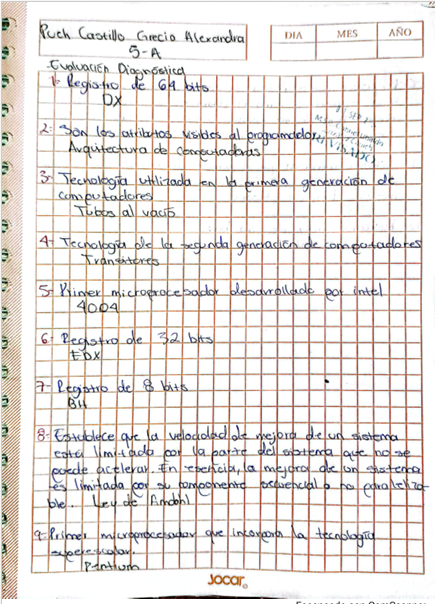
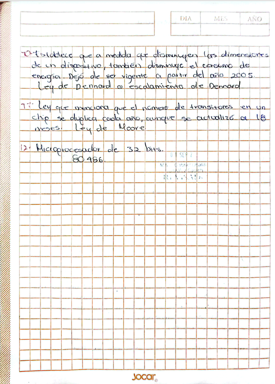
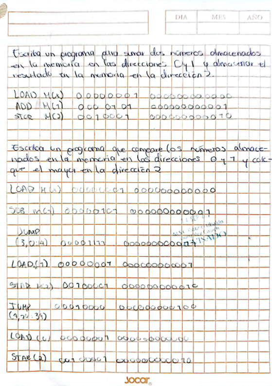
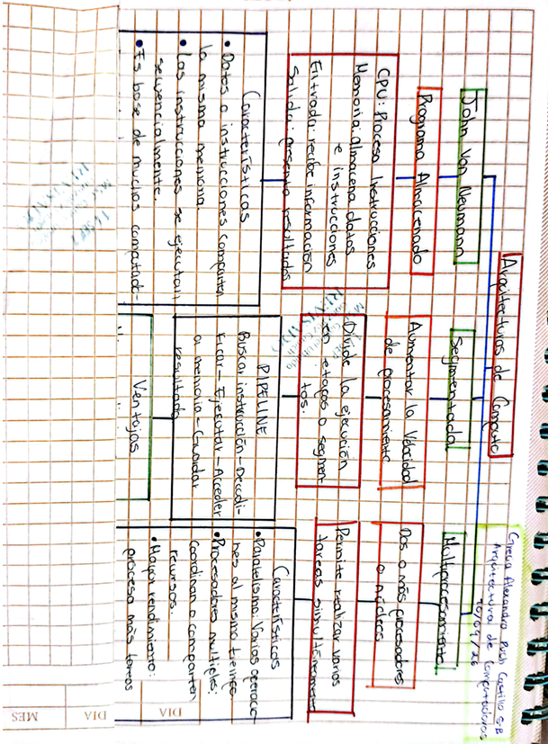
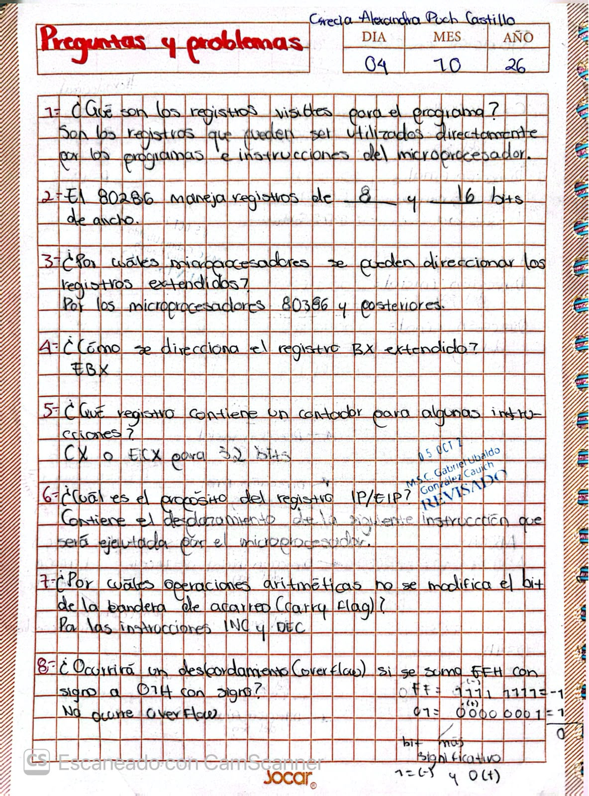
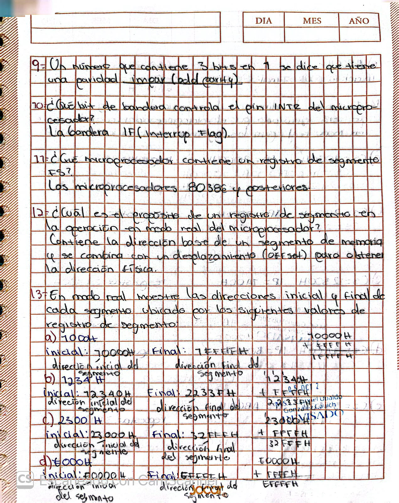
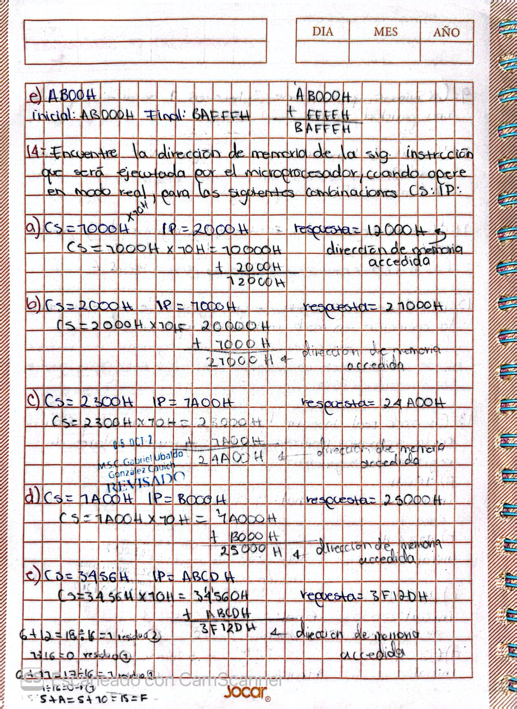
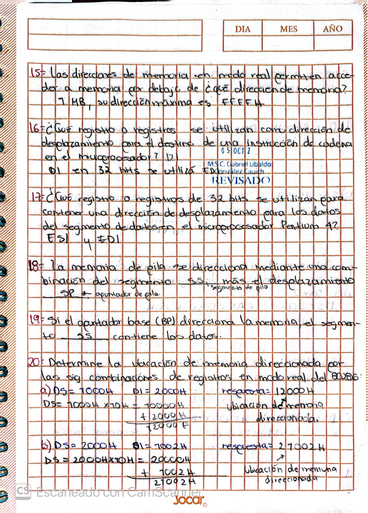
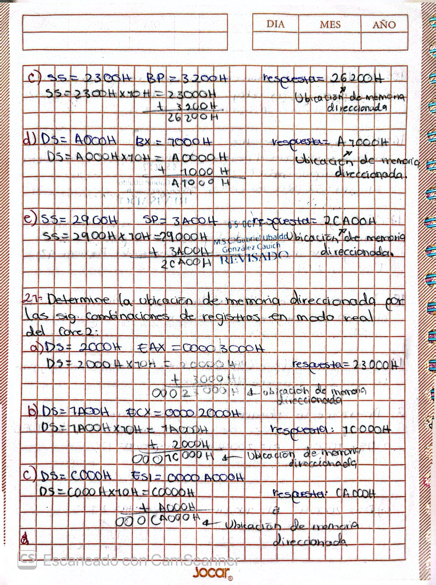
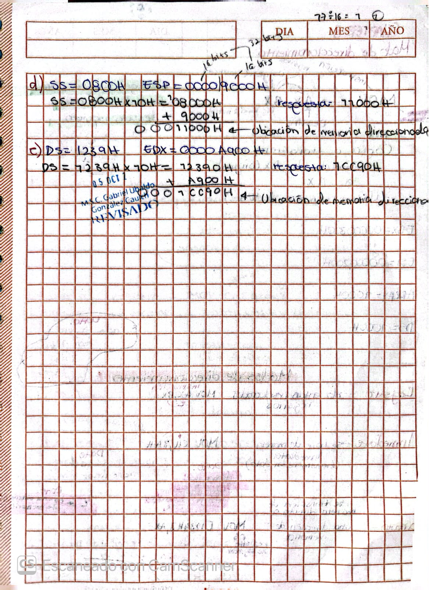

# PORTAFOLIO DE EVIDENCIAS

## Arquitectura de Computadoras

**Instituto:** Instituto Tecnológico de Motul
**Docente:** Gabriel Ubaldo González Cauich 
**Alumno:** Grecia Alexandra Puch Castillo  
**Materia:** Arquitectura de Computadoras  
**Fecha:** 23/09/2026  

---

# ÍNDICE

1. [Introducción](#introducción)
2. [Unidad 1. Actividad 1: Evaluación diagnóstica](#unidad-1-actividad-1-evaluación-diagnóstica)
3. [Actividad 2. Ejercicios de programación](#actividad-2-ejercicios-de-programación)
4. [Actividad 3. Mapa conceptual](#actividad-3-mapa-conceptual)
5. [Actividad 4. Reporte de práctica](#actividad-4-reporte-de-práctica)
6. [Conclusión](#conclusión)
7. [Unidad 2. Actividad 1: Ejercicios de direccionamiento de memoria segmentada](#unidad-2-actividad-1-ejercicios-de-direccionamiento-de-memoria-segmentada)
8. [Actividad 2: Preguntas y problemas sobre registros y direccionamiento de memoria](#actividad-2-preguntas-y-problemas-sobre-registros-y-direccionamiento-de-memoria)

---

# INTRODUCCIÓN

Este portafolio de evidencias reúne las actividades realizadas durante el curso de Arquitectura de Computadoras. Su propósito es mostrar las evidencias de trabajo y reflexionar sobre los conocimientos y habilidades que fui desarrollando durante las actividades.

Las evidencias incluidas permiten observar diferentes tipos de aprendizaje. Algunas actividades están relacionadas con conceptos teóricos de arquitectura de computadoras, mientras que otras requieren aplicar los conocimientos mediante instrucciones y ejercicios de programación.

En este portafolio también se analizan los errores que se presentaron durante las actividades y las acciones que puedo realizar para mejorar mi aprendizaje.

Las actividades incluidas hasta este momento son una evaluación diagnóstica, ejercicios de programación y un mapa conceptual sobre arquitectura de computadoras. Posteriormente se agregará el reporte de una práctica realizada durante el curso.

---

# Unidad 1. ACTIVIDAD 1: EVALUACIÓN DIAGNÓSTICA

## Evidencia

La primera actividad corresponde a una evaluación diagnóstica. En ella se realizaron diferentes preguntas relacionadas con los fundamentos de la arquitectura de computadoras y la evolución de los microprocesadores.

Entre los temas abordados se encuentran:

- Registros de diferentes tamaños.
- Arquitectura de computadoras.
- Primera generación de computadoras.
- Segunda generación de computadoras.
- Transistores.
- Microprocesador Intel 4004.
- Ley de Amdahl.
- Ley de Dennard.
- Ley de Moore.
- Microprocesadores de 32 bits.
- Intel 80486.

### Evidencia escaneada





---

## ¿Qué aprendizajes obtuve?

Esta actividad me permitió identificar los conocimientos que ya tenía antes de comenzar a estudiar los temas de la materia. Al responder las preguntas pude recordar algunos conceptos relacionados con la arquitectura de las computadoras y la evolución de los microprocesadores.

Uno de los aprendizajes fue reconocer que existen registros de diferentes tamaños y que estos se relacionan con la cantidad de información que puede manejar un procesador.

También pude relacionar la evolución de las computadoras con el desarrollo de nuevas tecnologías, como los transistores y los microprocesadores.

La evaluación también me permitió identificar algunos temas que necesitaba reforzar, principalmente aquellos relacionados con datos históricos y características específicas de diferentes procesadores.

### Aprendizaje conceptual

Comprendí que la arquitectura de una computadora está formada por diferentes componentes que trabajan de manera conjunta. También comprendí que los procesadores han evolucionado con el desarrollo de nuevas tecnologías.

### Aprendizaje procedimental

Para realizar la actividad tuve que analizar cada pregunta y utilizar los conocimientos que ya tenía para elaborar mis respuestas. Esto me permitió reconocer cuáles conceptos podía explicar con mayor facilidad y cuáles necesitaba estudiar nuevamente.

### Aprendizaje actitudinal

La actividad me ayudó a reconocer la importancia de identificar mis propias áreas de oportunidad. Los errores no solamente representan algo negativo, sino que también permiten saber qué temas necesito reforzar.

---

## Análisis de errores

Uno de los principales errores que pude identificar fue depender en algunos casos de lo que recordaba en lugar de tener completamente claros los conceptos.

También fue necesario reforzar algunos datos relacionados con la evolución de los microprocesadores y las diferentes generaciones de computadoras.

Esto me permitió darme cuenta de que no es suficiente memorizar información, sino que es necesario comprender los conceptos para poder explicarlos y relacionarlos.

---

## Propuesta de mejora

Para mejorar mi aprendizaje puedo:

1. Repasar los conceptos de arquitectura de computadoras.
2. Elaborar una línea del tiempo de los microprocesadores.
3. Investigar las características de los procesadores estudiados.
4. Comparar registros de diferentes tamaños.
5. Repasar las leyes relacionadas con la evolución de los procesadores.
6. Realizar nuevamente ejercicios similares después de estudiar los temas.

---

## Integración de teoría y práctica

La evaluación me permitió relacionar conceptos teóricos con elementos que forman parte de las computadoras.

Por ejemplo, los registros forman parte del funcionamiento interno de los procesadores y permiten trabajar con información durante la ejecución de operaciones.

También pude relacionar la evolución de los transistores y los microprocesadores con el desarrollo de computadoras cada vez más capaces.

---

## Reflexión personal

Considero que esta actividad fue importante porque funcionó como un punto de partida para conocer mis conocimientos sobre la materia.

Algunas preguntas pude responderlas utilizando conocimientos previos, mientras que otras me hicieron notar que necesitaba estudiar nuevamente determinados conceptos.

Esto me permitió conocer mis áreas de oportunidad y entender que durante el curso tendría que reforzar algunos temas.

---

# ACTIVIDAD 2. EJERCICIOS DE PROGRAMACIÓN

## Descripción de la actividad

La segunda actividad consistió en realizar ejercicios relacionados con instrucciones de programación y almacenamiento de datos en memoria.

En esta actividad se realizaron dos ejercicios principales. El primero consistió en sumar dos números almacenados en las direcciones de memoria 0 y 1 y guardar el resultado en la dirección 2.

El segundo ejercicio consistió en comparar dos números almacenados en las direcciones de memoria 0 y 1 para determinar cuál de ellos era mayor y almacenar el resultado correspondiente en la dirección 2.

---

## Ejercicio 1. Suma de dos números

### Objetivo

Realizar un programa que permita sumar dos números almacenados en las direcciones de memoria 0 y 1 y almacenar el resultado en la dirección de memoria 2.

### Instrucciones utilizadas

Las instrucciones utilizadas para realizar la suma fueron:

```text
LOAD M(0)
ADD M(1)
STR M(2)
```

### Procedimiento

Primero se utiliza la instrucción `LOAD M(0)` para cargar el valor que se encuentra almacenado en la dirección de memoria 0.

Después se utiliza la instrucción `ADD M(1)` para sumar al valor anterior el número almacenado en la dirección de memoria 1.

Finalmente se utiliza la instrucción `STR M(2)` para almacenar el resultado de la operación en la dirección de memoria 2.

Por lo tanto, el procedimiento realizado es:

```text
Memoria 0 → cargar valor
Memoria 1 → sumar valor
Memoria 2 → guardar resultado
```

### Explicación de las instrucciones

- `LOAD M(0)`: carga el valor almacenado en la dirección de memoria 0.
- `ADD M(1)`: suma el valor almacenado en la dirección de memoria 1.
- `STR M(2)`: almacena el resultado de la operación en la dirección de memoria 2.

### Resultado esperado

Después de ejecutar las instrucciones, la dirección de memoria 2 contiene el resultado de sumar los valores almacenados en las direcciones 0 y 1.

---

## Ejercicio 2. Comparación de dos números

### Objetivo

Realizar un programa que permita comparar dos números almacenados en las direcciones de memoria 0 y 1 y colocar el número mayor en la dirección de memoria 2.

### Instrucciones utilizadas

Para realizar la comparación se utilizaron instrucciones de carga, resta, salto y almacenamiento.

```text
LOAD
SUB
JUMP
STR
```

### Procedimiento

Primero se carga uno de los valores almacenados en memoria.

Después se realiza una resta entre los valores para determinar cuál de los dos números es mayor.

El resultado de la resta permite determinar hacia qué parte del programa debe continuar la ejecución mediante una instrucción de salto.

Después del salto se almacena en la dirección de memoria 2 el valor que corresponde al número mayor.

El procedimiento puede representarse de la siguiente manera:

```text
Memoria 0 → cargar valor
Memoria 1 → comparar valor
SUB → realizar comparación mediante resta
JUMP → dirigir la ejecución
STR → guardar el número mayor en memoria 2
```

### Funcionamiento

La comparación se realiza mediante la resta de los valores.

El resultado obtenido permite determinar cuál de los dos valores es mayor.

La instrucción `JUMP` permite dirigir la ejecución hacia la parte correspondiente del programa.

Finalmente, mediante `STR`, se almacena el valor mayor en la dirección de memoria 2.

### Explicación de las instrucciones

- `LOAD`: permite cargar un valor almacenado en memoria.
- `SUB`: permite realizar la resta entre los valores utilizados para la comparación.
- `JUMP`: permite modificar el flujo de ejecución dependiendo del resultado de la operación.
- `STR`: permite almacenar el valor correspondiente en una posición de memoria.

### Resultado esperado

Al finalizar la ejecución del programa, la dirección de memoria 2 contiene el número mayor de los dos valores utilizados en la comparación.

### Evidencia



---

## ¿Qué aprendizajes obtuve?

Esta actividad me permitió comprender de una manera más práctica cómo un procesador puede trabajar con información almacenada en memoria.

Al realizar los ejercicios pude observar que las instrucciones deben ejecutarse en un orden determinado para obtener el resultado esperado.

También comprendí que las posiciones de memoria son importantes porque en ellas se encuentran los datos que serán utilizados durante la ejecución del programa.

### Aprendizaje conceptual

Comprendí la función de diferentes instrucciones utilizadas durante los ejercicios:

- `LOAD`: permite cargar un valor almacenado en memoria.
- `ADD`: permite realizar una suma.
- `SUB`: permite realizar una resta.
- `JUMP`: permite modificar el flujo de ejecución.
- `STR`: permite almacenar un resultado en una posición de memoria.

También reforcé la relación entre el procesador, las instrucciones y la memoria.

### Aprendizaje procedimental

Aprendí a dividir un problema en diferentes pasos antes de escribir las instrucciones.

En el ejercicio de suma primero se identifican las posiciones donde se encuentran los datos, después se realiza la operación y finalmente se guarda el resultado.

En el ejercicio de comparación se realiza una operación que permite determinar cuál de los valores es mayor y posteriormente se utiliza una instrucción de salto para continuar con la parte correspondiente del programa.

Este procedimiento me permitió comprender que antes de escribir las instrucciones es necesario analizar qué se quiere obtener como resultado.

### Aprendizaje actitudinal

La actividad me ayudó a tener mayor cuidado al escribir las instrucciones.

Comprendí que una dirección de memoria incorrecta o una instrucción colocada en un orden equivocado puede cambiar el resultado del programa.

También aprendí que es importante revisar paso por paso lo que ocurre durante la ejecución y comprobar que el resultado obtenido sea el esperado.

---

## Análisis de errores

Uno de los aspectos que debo cuidar al realizar este tipo de ejercicios es no confundir las direcciones de memoria.

También debo prestar atención al orden de las instrucciones, ya que cada instrucción depende de lo que se haya realizado anteriormente.

En el ejercicio de comparación se debe tener especial cuidado con las instrucciones de salto, debido a que estas determinan cómo continúa la ejecución del programa.

Otro aspecto que debo mejorar es comprobar qué valor queda después de cada operación antes de continuar con la siguiente instrucción.

También es importante revisar que el resultado final sea almacenado en la dirección de memoria indicada en el ejercicio.

---

## Propuesta de mejora

Para mejorar en futuros ejercicios puedo:

1. Identificar primero las posiciones de memoria utilizadas.
2. Escribir el procedimiento antes de escribir las instrucciones.
3. Revisar el significado de cada instrucción.
4. Realizar una tabla para seguir los valores durante la ejecución.
5. Comprobar el resultado después de cada operación.
6. Practicar más ejercicios de comparación.
7. Revisar el funcionamiento de las instrucciones de salto.
8. Revisar que el resultado final se almacene en la dirección solicitada.
9. Analizar paso por paso la ejecución antes de considerar terminado el ejercicio.

---

## Integración de teoría y práctica

Esta actividad permitió aplicar de manera práctica conceptos relacionados con la Arquitectura de Computadoras.

La teoría explica que el procesador trabaja con instrucciones y datos almacenados en memoria. En estos ejercicios pude representar este proceso mediante instrucciones concretas.

El ejercicio de suma permitió observar cómo se puede cargar información, procesarla y guardar un resultado.

El ejercicio de comparación permitió comprender que las instrucciones también pueden utilizarse para modificar el flujo de ejecución de un programa.

De esta manera, los ejercicios permitieron relacionar los conceptos estudiados en clase con una aplicación práctica basada en instrucciones y posiciones de memoria.

---

## Reflexión personal

Esta actividad fue importante porque pude pasar de los conceptos teóricos a un procedimiento más práctico.

Al principio las instrucciones pueden parecer solamente palabras, pero al analizarlas en orden pude comprender que cada una tiene una función específica dentro del procesamiento.

También comprendí que para realizar correctamente un programa es necesario tener cuidado con las posiciones de memoria, las operaciones y el orden en que se ejecutan las instrucciones.

El ejercicio de suma me ayudó a comprender cómo se puede realizar una operación utilizando datos almacenados en memoria.

El ejercicio de comparación me permitió comprender que también es posible utilizar instrucciones para tomar una decisión y modificar el flujo de ejecución.

---

## Conclusión de la actividad

Los ejercicios de programación permitieron reforzar los conocimientos relacionados con memoria, instrucciones y procesamiento de datos.

El primer ejercicio permitió trabajar una operación de suma utilizando las posiciones de memoria 0, 1 y 2.

El segundo ejercicio permitió trabajar una comparación mediante una resta y utilizar una instrucción de salto para determinar qué valor debía almacenarse.

De esta manera, la actividad permitió relacionar los conceptos teóricos de Arquitectura de Computadoras con la ejecución de instrucciones.

Además, los ejercicios ayudaron a comprender que para obtener un resultado correcto es necesario analizar el problema, organizar las instrucciones y revisar cada paso de la ejecución.

# Actividad 3. Mapa conceptual

## Descripción de la actividad

La tercera actividad consistió en elaborar un mapa conceptual sobre Arquitectura de Cómputo.

El mapa conceptual organiza diferentes conceptos relacionados con la arquitectura de las computadoras y muestra las relaciones que existen entre ellos.

Los principales conceptos representados en el mapa son:

- John Von Neumann.
- Programa almacenado.
- CPU.
- Memoria.
- Entrada.
- Salida.
- Características.
- Segmentación.
- Pipeline.
- Ventajas.
- Multiprocesamiento.
- Características del multiprocesamiento.

---

## Evidencia



---

## John Von Neumann

En el mapa conceptual se presenta a **John Von Neumann** como uno de los conceptos principales relacionados con la Arquitectura de Cómputo.

Este concepto se relaciona con el **Programa Almacenado**.

A partir de este concepto se presentan diferentes elementos relacionados con el funcionamiento de la computadora.

---

## Programa Almacenado

El mapa conceptual relaciona el programa almacenado con diferentes componentes:

- CPU.
- Memoria.
- Entrada.
- Salida.

### CPU

La CPU se encarga de **procesar instrucciones**.

### Memoria

La memoria se encarga de **almacenar datos e instrucciones**.

### Entrada

La entrada permite **recibir información**.

### Salida

La salida permite **presentar resultados**.

---

## Características

En el mapa conceptual se presentan diferentes características relacionadas con la arquitectura de Von Neumann:

- Los datos e instrucciones comparten la misma memoria.
- Las instrucciones se ejecutan secuencialmente.
- Es base de muchos computadores.

Estas características permiten identificar algunos de los elementos principales de este modelo de arquitectura.

---

## Segmentación

Otro de los conceptos que aparece en el mapa es la **Segmentación**.

En el mapa se indica que la segmentación permite:

**Aumentar la velocidad de procesamiento.**

También se señala que:

**Divide la ejecución en etapas o segmentos.**

Por lo tanto, la segmentación organiza la ejecución mediante diferentes etapas.

---

## Pipeline

El mapa conceptual también presenta el concepto de **Pipeline**.

En el mapa se representan diferentes etapas del procesamiento:

```text
Buscar instrucción
        ↓
Decodificar
        ↓
Ejecutar
        ↓
Acceder a memoria
        ↓
Guardar resultado
```

Estas etapas representan diferentes partes del proceso de ejecución de una instrucción.

---

## Ventajas

En el mapa conceptual se relaciona la segmentación con el aumento de la velocidad de procesamiento.

La división de la ejecución en diferentes etapas permite organizar el procesamiento de las instrucciones.

El pipeline también representa una forma de organizar las diferentes etapas que intervienen en la ejecución de una instrucción.

---

## Multiprocesamiento

El mapa conceptual también incluye el concepto de **Multiprocesamiento**.

En esta parte se indica:

**Dos o más procesadores o núcleos.**

También se relaciona con:

**Realizar varias tareas simultáneamente.**

Esto permite identificar el multiprocesamiento como una forma de trabajar con varios procesadores o núcleos.

---

## Características del multiprocesamiento

En el mapa se presentan diferentes características relacionadas con el multiprocesamiento.

### Paralelismo

El mapa señala:

**Varios procesos al mismo tiempo.**

### Procesadores múltiples

Los procesadores múltiples:

**Coordinan o comparten recursos.**

### Mayor rendimiento

El mapa relaciona el multiprocesamiento con un:

**Mayor rendimiento.**

También se relaciona con la posibilidad de procesar más tareas.

---

## ¿Qué aprendizajes obtuve?

La elaboración del mapa conceptual me permitió organizar diferentes conceptos relacionados con la Arquitectura de Cómputo.

Al realizar el mapa pude identificar la relación entre John Von Neumann y el concepto de programa almacenado.

También pude comprender la relación entre la CPU, la memoria, la entrada y la salida.

Además, pude identificar conceptos relacionados con el procesamiento de instrucciones, como la segmentación y el pipeline.

El apartado de multiprocesamiento me permitió reconocer la relación entre el uso de dos o más procesadores o núcleos y la realización de varias tareas.

---

## Aprendizaje conceptual

Uno de los principales aprendizajes fue comprender la relación entre el programa almacenado y los diferentes componentes de una computadora.

También reforcé los conceptos de:

- CPU.
- Memoria.
- Entrada.
- Salida.
- Segmentación.
- Pipeline.
- Multiprocesamiento.

Comprendí que estos conceptos se encuentran relacionados con diferentes partes del funcionamiento y procesamiento de una computadora.

También pude identificar que la segmentación divide la ejecución en diferentes etapas y que el pipeline representa estas etapas durante el procesamiento de una instrucción.

---

## Aprendizaje procedimental

Para realizar el mapa conceptual primero tuve que identificar los conceptos principales.

Después tuve que organizar la información y establecer las relaciones entre los diferentes conceptos.

También fue necesario seleccionar la información más importante de cada tema para poder representarla de manera clara dentro del mapa.

Este procedimiento me permitió practicar la organización de información y la relación entre diferentes conceptos.

---

## Aprendizaje actitudinal

La actividad me ayudó a tener mayor cuidado al organizar la información.

También comprendí que la forma en que se presenta la información puede facilitar su comprensión.

Al realizar el mapa tuve que revisar las relaciones entre los conceptos y procurar que la información estuviera organizada de manera clara.

---

## Análisis de errores

Uno de los errores que pueden presentarse al realizar un mapa conceptual es colocar conceptos sin establecer correctamente la relación que existe entre ellos.

También puede ocurrir que se coloque demasiada información y que el mapa sea difícil de comprender.

Otro aspecto que se debe cuidar es que cada concepto se encuentre relacionado con la información correspondiente.

Por esta razón es importante revisar las conexiones entre los conceptos antes de finalizar el mapa.

---

## Propuesta de mejora

Para mejorar futuros mapas conceptuales puedo:

1. Identificar primero el concepto principal.
2. Seleccionar los conceptos más importantes.
3. Organizar la información de manera jerárquica.
4. Establecer correctamente las relaciones entre los conceptos.
5. Utilizar palabras de enlace claras.
6. Evitar información repetida.
7. Evitar colocar información innecesaria.
8. Revisar que todas las conexiones tengan sentido.
9. Revisar el mapa completo antes de entregarlo.

---

## Integración de teoría y práctica

Esta actividad permitió organizar de manera visual diferentes conceptos relacionados con la Arquitectura de Cómputo.

Los conceptos de CPU, memoria, entrada y salida permitieron relacionar la información teórica con los componentes principales de una computadora.

La segmentación permitió comprender que la ejecución puede dividirse en diferentes etapas.

El pipeline permitió representar las diferentes etapas relacionadas con la ejecución de una instrucción:

```text
Buscar instrucción
        ↓
Decodificar
        ↓
Ejecutar
        ↓
Acceder a memoria
        ↓
Guardar resultado
```

Por otra parte, el multiprocesamiento permitió relacionar la teoría con el uso de dos o más procesadores o núcleos para realizar diferentes tareas.

---

## Reflexión personal

Realizar este mapa conceptual me ayudó a comprender mejor la relación entre los diferentes conceptos de la actividad.

Al organizar la información de manera visual pude identificar que los conceptos no se encuentran aislados, sino que tienen relación entre ellos.

También pude comprender mejor la relación entre John Von Neumann, el programa almacenado y los componentes de la computadora.

Los conceptos de segmentación y pipeline me ayudaron a comprender que la ejecución de instrucciones puede organizarse en diferentes etapas.

El concepto de multiprocesamiento también me permitió identificar cómo se pueden utilizar dos o más procesadores o núcleos para realizar varias tareas.

Considero que esta actividad fue útil porque me permitió organizar la información y visualizar las relaciones entre los diferentes conceptos.

---

## Conclusión de la actividad

El mapa conceptual permitió organizar diferentes conceptos relacionados con la Arquitectura de Cómputo.

A través del mapa pude relacionar a John Von Neumann con el programa almacenado y con elementos como la CPU, la memoria, la entrada y la salida.

También pude identificar las características relacionadas con esta arquitectura.

La segmentación y el pipeline permitieron comprender la organización de la ejecución de instrucciones mediante diferentes etapas.

El multiprocesamiento permitió identificar conceptos como el paralelismo, los procesadores múltiples y el mayor rendimiento.

En conclusión, esta actividad permitió reforzar los conocimientos teóricos y organizarlos de manera visual para facilitar su comprensión.

# Actividad 4. Reporte de práctica

## Introducción

Durante esta práctica utilizamos el componente **6116**, conocido también como RAM estática, utilizado para el almacenamiento y la recuperación de datos digitales. Esta práctica permitió comprender de una manera más práctica cómo funciona una memoria, así como la relación que existe entre las líneas de dirección, los datos y las señales de control.

Durante el desarrollo de la práctica se realizó la conexión del componente 6116, junto con los componentes **SN74LS126AN** y el decodificador **74LS48**. También se utilizaron diferentes elementos como DIP switches, LEDs, resistencias, cables, un display y botones pulsadores.

El objetivo fue que, mediante la introducción de un valor binario, este pudiera almacenarse en una dirección determinada de la memoria y posteriormente recuperarse para visualizarlo en un display. De esta manera, la práctica permitió observar físicamente el funcionamiento del almacenamiento y recuperación de información, además de desarrollar mayor habilidad para realizar conexiones de circuitos digitales en un protoboard.

---

# Materiales

| Material | Imagen |
|---|---|
| RAM estática 6116 | 
| SN74LS126AN | 
| Decodificador 74LS48 | 
| Protoboards | 
| DIP switch | 
| LED | 
| Resistencia de 550 Ω | 
| Resistencia de 210 Ω | 
| Cables | 
| Display | 
| Push button | 

---

# Procedimiento

El primer paso fue juntar dos placas de pruebas o protoboards para poder realizar el montaje del circuito. En la parte superior se conectaron la **RAM estática 6116**, el componente **SN74LS126AN** y el decodificador **74LS48**.

Posteriormente, se conectó el primer DIP switch a la RAM estática. Este se utilizó para introducir los valores binarios. Los cuatro cables correspondientes se conectaron a los pines **5, 6, 7 y 8**, que representan las líneas de dirección **A0 a A3**.

Los pines **1, 2, 3 y 4** se conectaron a tierra.

Después, el segundo DIP switch se conectó a los pines **9, 10 y 12**, correspondientes a las entradas **1, 2 y 3**.

El tercer DIP switch se conectó a los pines **17, 19 y 20**, encargados de enviar las señales necesarias para determinar si la memoria se encuentra en modo de bloqueo, lectura o escritura.

Estas señales trabajan junto con el componente **SN74LS126AN**, y posteriormente la información se envía al decodificador **74LS48**, que permite convertir los datos para que puedan mostrarse en el display.

Cuando la RAM se encuentra en modo de escritura, uno de los push buttons se utiliza para guardar el dato en la dirección seleccionada. Para realizar el guardado del dato, se debe mantener presionado el botón durante aproximadamente **10 segundos**.

El segundo push button se utiliza cuando la RAM está en modo de lectura. Al presionarlo, el circuito muestra en el display el número que previamente fue almacenado en la dirección seleccionada.

---

# Funcionamiento de la práctica

El funcionamiento de la práctica se basa en introducir un valor mediante los DIP switches y seleccionar la dirección de memoria en la que se desea almacenar.

Primero se selecciona la dirección mediante las líneas correspondientes. Después se establece el valor que se desea almacenar utilizando los interruptores de datos.

Una vez configurado el circuito en modo de escritura, se utiliza el primer push button para guardar el dato en la memoria.

Posteriormente, al cambiar el circuito al modo de lectura, se puede seleccionar nuevamente la dirección donde se almacenó el dato y utilizar el segundo push button para recuperar la información.

Finalmente, el dato recuperado se envía hacia el circuito de decodificación para poder visualizar el número en el display.

De esta manera se pudo observar de forma práctica la diferencia entre **almacenar un dato y recuperar un dato** de una memoria.

---

# Evidencias

## Evidencia 1


## Evidencia 2


---

# Nota sobre el diagrama esquemático

El diagrama final del circuito no se incluyó inicialmente debido a que durante la sesión de laboratorio se presentaron modificaciones necesarias para intentar aislar una falla técnica.

El esquema definitivo se entregará junto con la demostración funcional correspondiente a la práctica.

---

# Observaciones y dificultades

Durante las pruebas de la práctica se presentó un problema al momento de intentar leer los datos almacenados en la memoria RAM 6116.

Cuando se intentaba recuperar la información para que el display mostrara los números que previamente habían sido guardados, el circuito presentaba fallas al intentar recuperar principalmente los números **8, 4 y, en algunas ocasiones, el 2**.

Durante la hora de laboratorio se revisó el circuito con ayuda del profesor. Sin embargo, no fue posible encontrar con certeza el origen de la falla ni solucionarla completamente durante ese momento.

Como posibles causas se consideraron un **falso contacto en alguno de los cables** o algún problema relacionado con las conexiones del componente **SN74LS126AN**. Sin embargo, estas posibilidades no pudieron confirmarse.

Esta situación permitió observar que, en un circuito digital, una conexión que aparentemente se encuentra realizada correctamente puede provocar errores en el funcionamiento general del sistema.

---

# Análisis de errores

Uno de los principales problemas encontrados durante la práctica fue la dificultad para identificar el punto exacto donde se encontraba la falla.

Aunque el circuito permitía realizar parte del funcionamiento esperado, la recuperación de determinados valores no se realizaba correctamente. Esto dificultó determinar si el problema se encontraba en la memoria, en los cables, en los DIP switches, en el SN74LS126AN o en alguna otra conexión del circuito.

Otro aspecto que representó una dificultad fue la cantidad de conexiones realizadas en los protoboards. Al existir varios cables y componentes relacionados entre sí, era necesario revisar cuidadosamente cada conexión para evitar errores.

La principal área de mejora identificada fue la revisión sistemática del circuito. En lugar de revisar varias conexiones al mismo tiempo, es conveniente comprobar cada sección por separado para encontrar más fácilmente el origen del problema.

---

# Propuesta de mejora

Para mejorar el desarrollo de la práctica, una estrategia sería realizar el armado del circuito por etapas.

Primero se puede comprobar que la RAM 6116 reciba correctamente alimentación y que las líneas de dirección funcionen de acuerdo con lo esperado.

Después se puede verificar individualmente la entrada de datos mediante los DIP switches.

Posteriormente se puede comprobar el funcionamiento de las señales relacionadas con los modos de lectura y escritura.

También sería conveniente revisar individualmente el funcionamiento del **SN74LS126AN** antes de conectar todo el circuito.

Otra mejora sería identificar y marcar los cables correspondientes a cada señal. Esto permitiría reducir la posibilidad de confundir conexiones y facilitaría la revisión del circuito cuando se presente una falla.

Finalmente, se debe comprobar cada dirección y cada dato de manera individual antes de realizar la prueba completa del circuito.

---

# Aprendizajes obtenidos

## Aprendizaje conceptual

Durante esta práctica comprendí de una manera más clara cómo funciona una **memoria RAM estática 6116** y cómo se relacionan sus diferentes líneas para poder almacenar y recuperar información.

También comprendí la importancia de las **líneas de dirección**, ya que permiten seleccionar la posición de memoria donde se desea trabajar. De igual manera, comprendí que las líneas de datos son necesarias para introducir o recuperar la información almacenada.

Otro aprendizaje importante fue reconocer la función de las señales de control relacionadas con las operaciones de la memoria, principalmente **CS, OE y WE**, ya que permiten controlar las condiciones en las que se realiza la lectura o escritura.

También aprendí la función que tiene el **SN74LS126AN** dentro del circuito. Su utilización permite controlar el flujo de información mediante sus salidas de tres estados y ayuda a evitar conflictos entre las señales del circuito.

Además, comprendí la función del **74LS48**, que permite trabajar con la información para que pueda ser representada en el display.

---

## Aprendizaje procedimental

En la parte procedimental aprendí a realizar la conexión de una memoria RAM 6116 utilizando un protoboard y diferentes componentes de lógica digital.

Aprendí que antes de comenzar una conexión es necesario identificar correctamente los pines de cada componente y relacionarlos con la función que van a realizar dentro del circuito.

También practiqué la utilización de los **DIP switches** para introducir valores y seleccionar diferentes configuraciones.

Otro aprendizaje fue el procedimiento necesario para realizar las operaciones de escritura y lectura. Para almacenar un dato era necesario seleccionar la dirección y el valor correspondiente, configurar la memoria para la escritura y utilizar el push button.

Después, para recuperar el dato, era necesario configurar la memoria para la lectura y utilizar el segundo push button para visualizar el resultado en el display.

La práctica también me permitió desarrollar una mayor habilidad para revisar conexiones y buscar posibles errores en un circuito físico.

---

## Aprendizaje actitudinal

En el aspecto actitudinal aprendí la importancia de tener paciencia al trabajar con circuitos digitales, especialmente cuando el circuito no funciona como se esperaba.

La práctica también permitió comprender la importancia del trabajo cuidadoso, ya que una conexión incorrecta o un falso contacto puede afectar el funcionamiento completo del circuito.

Otro aprendizaje fue la importancia de revisar los errores de manera ordenada y no asumir inmediatamente cuál es la causa del problema.

A pesar de que durante la práctica no fue posible encontrar completamente la falla presentada, la situación permitió reconocer que los errores también forman parte del proceso de aprendizaje y que es necesario continuar realizando pruebas hasta encontrar una solución.

---

# Integración entre teoría y práctica

La práctica permitió relacionar los conceptos estudiados sobre memoria y circuitos digitales con un circuito físico.

La teoría indica que una memoria permite almacenar información en diferentes posiciones y posteriormente recuperar esos datos. Durante la práctica fue posible observar este proceso utilizando la RAM 6116.

Las líneas de dirección permitieron seleccionar una posición de memoria, mientras que las líneas de datos permitieron trabajar con la información que se quería almacenar o recuperar.

De igual manera, las señales de control permitieron diferenciar las operaciones de lectura y escritura.

El uso del SN74LS126AN permitió comprender que no solamente es necesario conectar la memoria, sino que también se necesitan circuitos que permitan controlar adecuadamente el flujo de información.

Por lo tanto, el montaje del circuito ayudó a relacionar los conceptos teóricos de memoria, dirección, datos y control con su implementación física en un protoboard.

---

# Reflexión personal

Esta práctica me permitió comprender mejor cómo funciona una memoria cuando se observa directamente en un circuito y no solamente desde la teoría.

Antes de realizar la práctica, los conceptos relacionados con las direcciones, los datos y las señales de control podían parecer solamente conexiones o nombres de pines. Al realizar el circuito pude observar que cada uno cumple una función específica y que todos deben trabajar correctamente para que la memoria pueda almacenar y recuperar información.

La dificultad que se presentó al recuperar algunos números también fue parte importante del aprendizaje, porque permitió comprender que en un circuito físico no basta con conocer la teoría. También es necesario tener cuidado con las conexiones, revisar los componentes y realizar pruebas para localizar los errores.

Considero que esta práctica me ayudó a desarrollar mayor confianza para trabajar con circuitos digitales y también me mostró la importancia de realizar las conexiones de manera ordenada.

---

# Conclusión

En esta práctica se logró comprender el funcionamiento básico de una **memoria RAM 6116** y la forma en que puede implementarse físicamente mediante un protoboard.

Se identificó la función de las líneas de dirección, datos y control, así como la importancia de las señales **CS, OE y WE** para realizar correctamente las operaciones de lectura y escritura.

También se comprendió la función del **SN74LS126AN**, utilizado como buffer de tres estados para controlar el flujo de información entre los interruptores y el bus de datos de la RAM. Su utilización permite controlar cuándo los datos pueden entrar o salir de la memoria y ayuda a evitar conflictos eléctricos.

La práctica también permitió observar la función del **74LS48** dentro del circuito y su relación con la visualización de los datos en el display.

Aunque durante las pruebas se presentó una falla al intentar recuperar algunos valores almacenados, principalmente los números **8, 4 y en ocasiones el 2**, esta dificultad también permitió identificar la importancia de revisar cuidadosamente las conexiones y realizar pruebas de manera ordenada.

En conjunto, el armado permitió observar de manera práctica cómo una memoria almacena información en diferentes direcciones y cómo los circuitos de control y los buffers permiten realizar estas operaciones de forma ordenada.

La práctica complementó los conocimientos teóricos vistos en clase y permitió desarrollar habilidades para realizar conexiones, identificar posibles errores y comprender de una manera más directa el funcionamiento de una memoria dentro de un circuito digital.

---
# Unidad 2. Actividad 1: Ejercicios de direccionamiento de memoria segmentada

## Objetivo de la actividad

Comprender cómo se calculan las direcciones iniciales y finales de los segmentos de memoria mediante operaciones en el sistema hexadecimal, y aplicar la relación entre un registro de segmento y un desplazamiento para obtener una dirección física.

## Descripción de la actividad

Durante esta actividad, realizada en clase, resolví varios ejercicios relacionados con el direccionamiento de memoria segmentada. Partí de valores de segmentos expresados en hexadecimal, los multipliqué por `10H` para determinar la dirección inicial y sumé `FFFFH` para obtener la última dirección de cada segmento. También trabajé con los registros `CS` e `IP` para calcular una dirección física específica.

Los ejercicios me permitieron practicar las operaciones hexadecimales y comprender la manera en que un procesador puede formar una dirección de memoria a partir de dos valores.

## Evidencia de la actividad



*Figura 1. Operaciones realizadas en clase para calcular direcciones iniciales, finales y una dirección física en hexadecimal.*

## Desarrollo de los ejercicios

Para los ejercicios utilicé las siguientes expresiones:

**Dirección inicial del segmento:**

```text
Dirección inicial = Segmento × 10H
```

**Dirección final del segmento:**

```text
Dirección final = Dirección inicial + FFFFH
```

**Dirección física utilizando segmento y desplazamiento:**

```text
Dirección física = (Segmento × 10H) + Desplazamiento
```

Estas expresiones corresponden al direccionamiento segmentado en modo real, donde el desplazamiento puede variar desde `0000H` hasta `FFFFH`.

### Resultados obtenidos

| Valor del segmento | Dirección inicial | Dirección final |
|:---:|:---:|:---:|
| `2000H` | `20000H` | `2FFFFH` |
| `2001H` | `20010H` | `3000FH` |
| `2100H` | `21000H` | `30FFFH` |
| `AB00H` | `AB000H` | `BAFFFH` |
| `1234H` | `12340H` | `2233FH` |


## ¿Qué aprendizaje obtuve?

Aprendí a calcular direcciones de memoria a partir de números hexadecimales y a reconocer la diferencia entre la dirección inicial de un segmento, su dirección final y una dirección física determinada por un desplazamiento. Antes de desarrollar los ejercicios, la relación entre segmentos y posiciones de memoria me parecía abstracta; al efectuar las operaciones, pude observar que existe una regla matemática que permite ubicar cada dirección. También reforcé el uso de las letras `A`, `B`, `C`, `D`, `E` y `F` como dígitos hexadecimales y comprendí la importancia de respetar el valor de cada posición.

## Aprendizaje conceptual

Comprendí que la memoria segmentada es una forma de organizar y localizar información mediante segmentos y desplazamientos. Un segmento señala una dirección base, mientras que el desplazamiento indica una posición con respecto a esa base. En los ejercicios de direccionamiento en modo real, multiplicar el valor del segmento por `10H` equivale a desplazarlo cuatro bits hacia la izquierda. A partir de esa dirección inicial, sumar `FFFFH` permite encontrar la última dirección que puede representarse con un desplazamiento de 16 bits.

Asimismo, comprendí la función de los registros `CS` (segmento de código) e `IP` (puntero de instrucción), y cómo ambos valores se combinan para señalar una dirección de memoria. Este conocimiento me ayudó a relacionar los conceptos de arquitectura de computadoras, representación numérica y administración de memoria.

## Aprendizaje procedimental

Desarrollé la habilidad de resolver operaciones de multiplicación y suma en hexadecimal, siguiendo un procedimiento ordenado. Primero identifiqué el valor del segmento; después calculé su dirección inicial al multiplicarlo por `10H`; finalmente sumé `FFFFH` para determinar el límite superior de ese segmento. En el ejercicio de `CS:IP`, calculé la base del segmento y le agregué el desplazamiento indicado.

También practiqué la revisión de resultados, alineando correctamente las posiciones de los números y considerando los acarreos cuando una suma superaba el valor `F`. Este procedimiento es útil para interpretar direcciones de memoria y evitar errores de cálculo.

## Aprendizaje actitudinal

Esta actividad me permitió fortalecer mi paciencia, concentración, responsabilidad y disposición para resolver problemas. Reconocí que, en operaciones con diferentes bases numéricas, un pequeño descuido puede modificar por completo el resultado. Por eso fue importante trabajar de manera ordenada, revisar las operaciones y mantener una actitud de aprendizaje ante las dudas que surgieran.

También valoré la importancia de participar en los ejercicios de clase, prestar atención a las explicaciones y aceptar correcciones como una oportunidad para mejorar mis conocimientos.

## Análisis de errores

Al revisar este tipo de ejercicios, identifiqué varios puntos en los que es fácil equivocarse. Uno de ellos es confundir la suma hexadecimal con la decimal, ya que en hexadecimal se realiza un acarreo al llegar a `16`, no a `10`. Otro posible error es colocar de manera incorrecta los dígitos al sumar valores de diferente longitud, como `23000H` y `1A00H`. También es importante no confundir la dirección inicial del segmento con una dirección física que incluye un desplazamiento.

Para prevenir estos errores, revisé que la multiplicación por `10H` estuviera bien representada, alineé las operaciones de derecha a izquierda y comprobé que el resultado final conservara la notación hexadecimal. Esta revisión me ayudó a comprender que no basta con obtener un número: también debo verificar que el procedimiento utilizado sea correcto.

## Propuesta de mejora

Para mejorar mi desempeño en ejercicios posteriores, propongo elaborar una pequeña tabla de equivalencias entre valores decimales y hexadecimales, especialmente para los dígitos de `A` a `F`. También considero útil resolver primero algunos ejemplos sencillos y avanzar gradualmente hacia operaciones que requieran varios acarreos.

Otra mejora sería comprobar los resultados con una calculadora que admita el sistema hexadecimal, después de resolverlos manualmente. De esta manera podría detectar errores y entender dónde me equivoqué sin depender de la herramienta para realizar todo el procedimiento. Finalmente, procuraría escribir cada operación con mayor claridad, identificando el segmento, el desplazamiento y la dirección resultante.

## Integración de teoría y práctica

La teoría estudiada sobre la organización de la memoria se relacionó directamente con los ejercicios realizados. En clase aprendí que un procesador puede utilizar un segmento y un desplazamiento para localizar información; mediante los cálculos comprobé cómo se aplica esa idea matemáticamente. Por ejemplo, a partir de `CS = 2300H` e `IP = 1A00H` obtuve la dirección física `24A00H`.

Esta relación entre conceptos y operaciones me permitió comprender mejor por qué es importante conocer los sistemas de numeración en arquitectura de computadoras. Las operaciones no fueron solamente ejercicios matemáticos, sino una forma de representar cómo se calculan direcciones dentro de un sistema de memoria.

## Reflexión personal

Considero que esta actividad fue importante porque me ayudó a entender un tema que al principio puede resultar complicado por el uso de letras y números en una misma operación. A medida que fui siguiendo los pasos, comprendí que el sistema hexadecimal tiene reglas definidas y que los resultados se pueden obtener de manera lógica y ordenada.

Me di cuenta de que necesito practicar constantemente este tipo de operaciones para resolverlas con mayor rapidez y seguridad. También aprendí a darle importancia al procedimiento y no solamente al resultado, ya que comprender cada paso me permite explicar cómo llegué a una dirección de memoria. Esta práctica fortaleció mi confianza para abordar temas posteriores relacionados con el funcionamiento interno de las computadoras.

## Conclusión de la actividad

En conclusión, los ejercicios de direccionamiento de memoria segmentada me permitieron aplicar el sistema hexadecimal para encontrar direcciones iniciales, finales y direcciones físicas. Comprendí la relación entre el valor de un segmento y su desplazamiento, así como la utilidad de los registros `CS` e `IP` en el cálculo de direcciones.

Además de reforzar los conocimientos teóricos, desarrollé habilidades de cálculo, análisis y verificación de resultados. Esta actividad me dejó como aprendizaje principal que, para comprender el funcionamiento de la memoria de una computadora, es necesario conocer tanto los conceptos de direccionamiento como los procedimientos matemáticos que los sustentan.

# Actividad 2: Preguntas y problemas sobre registros y direccionamiento de memoria

## Objetivo de la actividad

Reforzar mis conocimientos sobre los registros internos de los microprocesadores, sus funciones, las banderas de estado y el direccionamiento de memoria en modo real, mediante la resolución de preguntas teóricas y problemas prácticos con números hexadecimales.

## Descripción de la actividad

En esta actividad, titulada **«Preguntas y problemas»**, respondí un cuestionario de 21 apartados sobre arquitectura de microprocesadores. Los primeros ejercicios estuvieron relacionados con los registros visibles para el programa, los registros de 8, 16 y 32 bits, el contador de instrucciones, las banderas y los registros de segmento. Posteriormente resolví problemas para encontrar direcciones iniciales y finales de segmentos, así como direcciones físicas de memoria utilizando diferentes combinaciones de registros.

La actividad me permitió ampliar lo visto en los ejercicios de clase: no solamente apliqué operaciones hexadecimales, sino que también analicé para qué sirven los registros y cómo se relacionan con el acceso a instrucciones, datos y memoria de pila.

## Evidencias de la actividad


*Figura 1. Preguntas 1 a 8 sobre los registros, el puntero de instrucciones y las banderas.*



*Figura 2. Preguntas 9 a 13 y comienzo de los cálculos de los límites de segmentos.*



*Figura 3. Continuación de los segmentos y ejercicio 14 de direcciones físicas con CS:IP.*



*Figura 4. Preguntas 15 a 20 y ejemplos de direccionamiento de datos.*



*Figura 5. Ejercicios de localización de memoria con DS, SS, BP, SP y registros extendidos.*



*Figura 6. Continuación de los ejercicios con registros de 32 bits.*

## Desarrollo de la actividad


### Parte 2. Direcciones iniciales y finales de segmentos

En el ejercicio 13 calculé los límites de varios segmentos. Apliqué las siguientes fórmulas:

```text
Dirección inicial = Segmento × 10H
Dirección final   = Dirección inicial + FFFFH
```

| Segmento | Dirección inicial | Dirección final |
|:---:|:---:|:---:|
| `1000H` | `10000H` | `1FFFFH` |
| `1234H` | `12340H` | `2233FH` |
| `2300H` | `23000H` | `32FFFH` |
| `E000H` | `E0000H` | `EFFFFH` |
| `AB00H` | `AB000H` | `BAFFFH` |

Comprendí que la dirección final se obtiene al considerar el mayor desplazamiento de 16 bits, `FFFFH`, tomando como referencia la base del segmento.

### Parte 3. Cálculo de direcciones físicas con CS e IP

En el ejercicio 14 utilicé el registro de segmento de código (`CS`) y el puntero de instrucción (`IP`) para localizar la dirección física correspondiente:

```text
Dirección física = (CS × 10H) + IP
```

| CS | IP | Dirección física |
|:---:|:---:|:---:|
| `1000H` | `2000H` | `12000H` |
| `2000H` | `1000H` | `21000H` |
| `2300H` | `1A00H` | `24A00H` |
| `1A00H` | `B000H` | `25000H` |
| `3456H` | `ABCDH` | `3F12DH` |

Por ejemplo:

```text
CS = 3456H
IP = ABCDH

3456H × 10H = 34560H
34560H + ABCDH = 3F12DH

Dirección física = 3F12DH
```

Con este ejercicio observé cómo la suma del desplazamiento a la dirección base permite localizar una instrucción dentro de la memoria.

### Parte 4. Direccionamiento con registros de datos y de pila

En el ejercicio 20 trabajé con las combinaciones `DS:DI`, `DS:SI`, `SS:BP`, `DS:BX` y `SS:SP`. Para cada una, identifiqué el segmento que proporciona la base y el registro que contiene el desplazamiento.

| Combinación | Valores empleados | Dirección física |
|---|---|:---:|
| `DS:DI` | `1000H:2000H` | `12000H` |
| `DS:SI` | `2000H:7002H` | `27002H` |
| `SS:BP` | `2300H:3200H` | `26200H` |
| `DS:BX` | `A000H:1000H` | `A1000H` |
| `SS:SP` | `2900H:3A00H` | `2CA00H` |

Estos cálculos reforzaron mi comprensión de que `DS` se asocia con el segmento de datos y `SS` con el segmento de pila, mientras que registros como `SI`, `DI`, `BX`, `BP` y `SP` pueden representar desplazamientos según el modo de direccionamiento empleado.

### Parte 5. Direccionamiento con registros extendidos

En el ejercicio 21 resolví problemas semejantes con registros de 32 bits, como `EAX`, `ECX`, `ESI`, `ESP` y `EDX`.

| Combinación | Valores empleados | Dirección calculada |
|---|---|:---:|
| `DS:EAX` | `2000H:00003000H` | `23000H` |
| `DS:ECX` | `1A00H:00002000H` | `1C000H` |
| `DS:ESI` | `C000H:0000A000H` | `CA000H` |
| `SS:ESP` | `0800H:00009000H` | `11000H` |
| `DS:EDX` | `1239H:0000A900H` | `1CC90H` |

Por ejemplo:

```text
DS = 1239H
EDX = 0000A900H

1239H × 10H = 12390H
12390H + A900H = 1CC90H

Dirección calculada = 1CC90H
```

En estos ejemplos los desplazamientos representados en registros extendidos permanecen dentro de `FFFFH`; por eso fue posible aplicar la misma relación aritmética utilizada en los problemas anteriores.

## ¿Qué aprendizaje obtuve?

Aprendí que los registros del microprocesador tienen funciones diferentes y que su contenido influye directamente en el procesamiento de instrucciones y el acceso a la memoria. Esta actividad me permitió comprender por qué existen registros de propósito general, índices, punteros, segmentos y banderas. También reforcé mis conocimientos sobre el sistema hexadecimal mediante ejercicios más variados que los de la actividad anterior.

Mi principal aprendizaje fue reconocer que, para calcular correctamente una dirección física, primero debo identificar qué registro aporta la base del segmento y cuál aporta el desplazamiento. Además, descubrí que los nombres y tamaños de los registros permiten identificar características de distintas generaciones de microprocesadores, como el 80286, el 80386 y modelos posteriores.

## Aprendizaje conceptual

Comprendí el significado de los registros visibles para el programa y la diferencia entre registros de 8, 16 y 32 bits. Aprendí que el prefijo `E`, presente en nombres como `EAX`, `EBX` y `ECX`, identifica versiones extendidas de 32 bits de registros clásicos de 16 bits. También relacioné los registros `CX` y `ECX` con operaciones de conteo y los registros `IP` y `EIP` con el seguimiento de la ejecución de instrucciones.

Otro conocimiento importante fue la función de las banderas, como `CF` (acarreo), `OF` (desbordamiento con signo), `PF` (paridad) e `IF` (habilitación de interrupciones enmascarables). Finalmente, comprendí que en el direccionamiento segmentado en modo real se utiliza una base de segmento y un desplazamiento, y que las combinaciones de registros pueden cambiar según se acceda al código, a los datos o a la pila.

## Aprendizaje procedimental

Aprendí a organizar una solución a partir de los datos proporcionados en cada problema. Primero identifiqué los registros involucrados; después diferencié el segmento del desplazamiento; posteriormente multipliqué el valor del segmento por `10H` y sumé el desplazamiento en hexadecimal para obtener la dirección correspondiente.

También ejercité la interpretación de los enunciados teóricos y la comparación de conceptos semejantes, por ejemplo, entre `IP` y `EIP` o entre `SP` y `ESP`. En los ejercicios aritméticos practiqué las sumas con dígitos de `A` a `F`, el manejo de acarreos y la revisión de resultados. Estas habilidades me permiten resolver problemas de direccionamiento con mayor orden y explicar el procedimiento que utilicé.

## Aprendizaje actitudinal

Esta actividad fortaleció mi perseverancia, disciplina y atención a los detalles. Al tratarse de un cuestionario extenso que combinaba preguntas teóricas y problemas numéricos, fue necesario mantener la concentración, administrar el tiempo y evitar responder apresuradamente.

También valoré la importancia de investigar o consultar mis apuntes cuando no recuerdo una definición, así como la disposición para corregir o aclarar una respuesta. Comprendí que la precisión es indispensable al estudiar arquitectura de computadoras, porque cambiar un dígito hexadecimal o confundir un registro puede alterar la interpretación de una dirección.

## Análisis de errores

Al revisar mis procedimientos, pude identificar los tipos de errores que debía prevenir. En las preguntas conceptuales, uno de los principales riesgos era confundir los registros de 16 bits con sus versiones extendidas de 32 bits o asignar a una bandera una función que corresponde a otra. Por ejemplo, la bandera de acarreo (`CF`) no es lo mismo que la de desbordamiento con signo (`OF`), y las instrucciones `INC` y `DEC` no modifican `CF`.

En los problemas de cálculo, el error más probable era sumar como si los valores fueran decimales, olvidar un acarreo hexadecimal o multiplicar incorrectamente el segmento por `10H`. Otro punto delicado fue distinguir entre `DS`, `SS` y `CS`, porque cada uno se relaciona con un contexto diferente de memoria. Los resultados aritméticos principales mostrados en mis evidencias son consistentes con la fórmula utilizada; por ello, mi análisis se enfoca en las dificultades y confusiones que estos ejercicios permiten detectar, sin atribuirme equivocaciones que no aparecen documentadas.

## Propuesta de mejora

Como propuesta de mejora, considero conveniente elaborar una tabla comparativa con el nombre, tamaño y función de cada registro. Esto facilitaría el estudio de las diferencias entre los registros tradicionales y los extendidos. También podría realizar un mapa conceptual que agrupe los registros de propósito general, los de segmento, los punteros y las banderas.

Para mejorar los cálculos, utilizaría un formato fijo con cuatro pasos: identificar los datos, calcular la base, sumar el desplazamiento y comprobar el resultado. Una vez hecho el procedimiento manual, verificaría las operaciones con una calculadora hexadecimal o una herramienta de simulación. Además, revisaría los nombres de los registros antes de comenzar para asegurarme de utilizar el segmento correcto.

## Integración de teoría y práctica

La parte teórica me permitió conocer las funciones de los registros, mientras que los problemas me ayudaron a observar cómo se aplican esos conocimientos al direccionamiento de memoria. Por ejemplo, aprendí que `CS` se relaciona con el código y `IP` con la posición de una instrucción; después utilicé ambos registros para calcular direcciones físicas concretas.

De igual manera, relacioné los registros `DS` y `SS` con las direcciones de datos y de pila al resolver problemas con `SI`, `DI`, `BX`, `BP` y `SP`. La actividad mostró que los conceptos de arquitectura no son definiciones aisladas: tienen una aplicación en los cálculos que permiten localizar instrucciones y datos dentro de la memoria.

## Reflexión personal

Esta segunda actividad me pareció más completa que la primera porque no se limitó a realizar operaciones, sino que también me hizo pensar en el significado de los registros que estaba utilizando. Al responder las preguntas, pude reconocer cuáles conceptos recordaba con facilidad y cuáles necesitaba estudiar con más detenimiento. Los ejercicios prácticos me ayudaron a consolidar la explicación teórica, especialmente en el uso de segmentos y desplazamientos.

Me di cuenta de que memorizar el nombre de un registro no es suficiente; también debo entender su función y saber en qué situaciones se utiliza. Considero que el cuestionario fue útil para medir mi avance en la unidad y para prepararme para temas posteriores. Me gustaría continuar practicando con ejemplos distintos y, cuando sea posible, observar estas operaciones mediante un simulador para comprender mejor lo que ocurre dentro del microprocesador.

## Conclusión de la actividad

En conclusión, la actividad **«Preguntas y problemas»** me permitió fortalecer mis conocimientos acerca de los registros del microprocesador, sus tamaños y funciones, las banderas de estado y el cálculo de direcciones de memoria. Mediante el cuestionario y los ejercicios comprendí mejor cómo se relacionan la arquitectura interna del procesador y el direccionamiento segmentado.

Además, reforcé mi capacidad para analizar preguntas, aplicar fórmulas, realizar operaciones hexadecimales y comprobar resultados. Considero que esta actividad fue fundamental para integrar los aspectos teóricos y prácticos de la Unidad 2, y me dejó una base más sólida para continuar estudiando el funcionamiento de los microprocesadores y la organización de la memoria.


